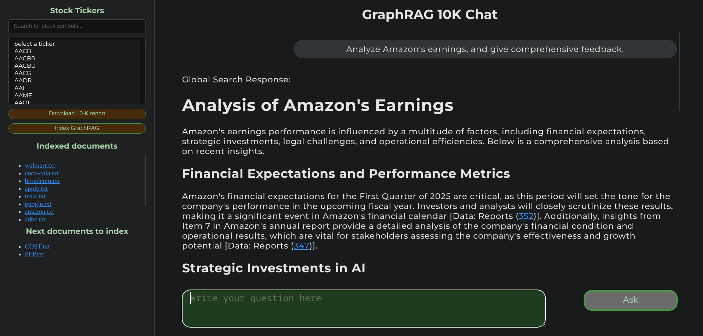

# 10-K Report Analyzer with GraphRAG



## Overview

This application allows users to download and analyze SEC 10-K reports for public companies using GraphRAG from Microsoft. Users can ask natural language questions about financial reports and receive AI-generated responses powered by OpenAI's 4o-mini model (you can use other models of course).

## Features

- **Document Retrieval**: Download 10-K reports for any publicly traded company (NYSE, NASDAQ)
- **GraphRAG Indexing**: Process documents using Graph Retrieval Augmented Generation for enhanced context awareness
- **Interactive Q&A**: Ask questions about company financials, risks, and business operations
- **AI-Powered Analysis**: Leverages OpenAI's 4o-mini model to generate comprehensive responses

## Technology Stack

- **Backend**: Django
- **Frontend**: HTMX
- **NLP**: GraphRAG for document indexing and context retrieval
- **AI Model**: OpenAI 4o-mini for response generation

## How It Works

1. Users select a company and download its 10-K report
2. After downloading all the wanted reports, the user clicks the index graphrag button, and the app indexes the newly downloaded reports.
3. Users can ask questions in natural language
4. The GraphRAG system retrieves relevant context from the indexed document
5. OpenAI's 4o-mini model generates comprehensive responses based on the retrieved context
6. Use the references with [graphrag-visualizer](https://github.com/noworneverev/graphrag-visualizer) integration to see the retrieved context in more detail in the graph's tables.

## Getting Started

#### Note:
_The following instructions are tested and work on **linux(fedora)** as well as on **wsl(Ubuntu)** on Windows.
If you try running it directly on **Windows**, you could get into some problems with ColBERT and GraphRAG._

### Prerequisites

- Python 3.11+
- Django
- Required Python packages (see [requirements.txt](https://github.com/idotem/stock_prediction_app/blob/graduation/requirements.txt)
- OpenAI API access (or you can configure graphrag yourself with whatever model you see fit)
- Set up GraphRAG in **graphrag-10k** 

### Installation

1. Clone this repository
2. Install dependencies:
   ```bash
   pip install -r requirements.txt
   ```
3. Initialize graphrag in graphrag-10k folder. Inside graphrag-10k, execute:
   ```bash
   graphrag index --root .
   ```
   This will generate settings.yaml and .env files in graphrag-10k.
4. If you want to use the template-settings.yaml that's already in graphrag-10k:
   - Delete the generated settings.yaml and rename the template-settings.yaml into settings.yaml.
   - Set your OpenAI API key as GRAPHRAG_API_KEY variable in generated .env file.
   
   _If you don't want to use the template-settings.yaml, you can configure the graphrag yourself with any 
   model you think is best!_
5. Start the Django server:
   ```bash
   python manage.py runserver
6. Download documents and index graphrag. Then query and ask questions.
